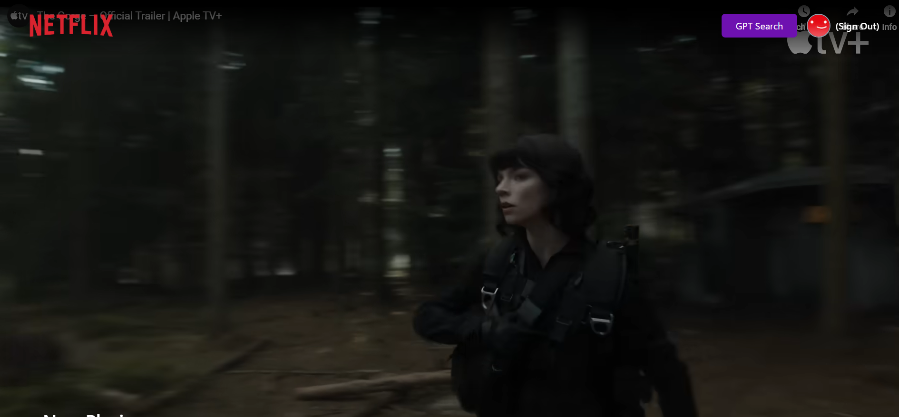

# 🎥 Netflix GPT

A movie streaming web application powered by **React**, **TailwindCSS**, **Firebase**, and **GPT API** that offers seamless movie browsing, personalized recommendations, and multi-language search.

<div align="center">
  
</div>

## 🚀 Tech Stack

- React.js
- TailwindCSS
- Firebase (Authentication & Storage)
- Redux Toolkit
- TMDB API
- OpenAI GPT API

## 🔑 Features

- 🔐 **Authentication**: Sign Up, Login & Logout
- 🌐 **Multi-Language Support**
- 🎯 **Movie Suggestions via GPT**
- 🎥 **Embedded YouTube Trailer Autoplay**
- 📄 **Movie Lists & Recommendations**
- 🎯 **Profile Update Functionality**
- 🔄 **Protected Routes with Redirection**
- 🔥 **Responsive Design**

## 📌 Project Setup

### Prerequisites

- [Node.js](https://nodejs.org/)
- [Git](https://git-scm.com/)

### Installation Steps

1. Clone the Repository:

```bash
git clone https://github.com/your-repo/netflix-gpt.git
cd netflix-gpt
```

2. Install Dependencies:

```bash
npm install
```

3. Set Environment Variables:
   Create `.env` file in the root directory and add the following:

```env
REACT_APP_TMDB_API_KEY=YOUR_TMDB_API_KEY
REACT_APP_OPENAI_API_KEY=YOUR_OPENAI_API_KEY
```

4. Run the Project:

```bash
npm start
```

Access the app at **http://localhost:3000**.

## 🎯 How It Works

1. **Sign Up / Login**
2. Browse the trending movies from TMDB API
3. Search movies with GPT-based suggestions
4. Watch movie trailers with autoplay
5. Enjoy personalized recommendations

## 📌 Note

Ensure you have valid **TMDB API** and **OpenAI API** keys before running the project.

Happy Streaming! 🍿
